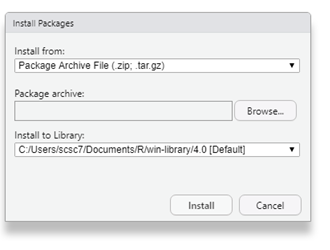

### Installing MiniConda 
1. Set up channels as per instructions here: https://bioconda.github.io/user/install.html#install-conda.
2. Create an environment with the tools needed. In this case, I created an environment called "rna-seq", and installed tools in the new "rna-seq" environment.
  ```
  conda create -n rna-seq -c bioconda samtools bam-readcount hisat2 stringtie gffcompare htseq tophat kallisto fastqc multiqc picard flexbar 
  ```
3. Activate the environment.
  ```
  conda activate rna-seq
  ```
### Running Nextflow nf-core RNA-Seq workflow  
Github repo for the rna-seq pipeline can be found here: https://github.com/nf-core/rnaseq.  
1. Install Nextflow as per the instructions here: https://nf-co.re/usage/installation.  
2. 
 


### Installing packages require for Differential Expression Analysis.
1. Open RStudio. Install Bioconductor and its packages (https://www.bioconductor.org/install/).
  ```
    if (!requireNamespace("BiocManager", quietly = TRUE))
    		    install.packages("BiocManager")
    BiocManager::install(version = "3.11")
  ```
2. Install Rtools40 as per the instructions given here: https://cran.r-project.org/bin/windows/Rtools/.  
3. Install refGenome for gene and splice site annotation.  
  3a. Navigate to: https://cran.r-project.org/src/contrib/Archive/refGenome/.  
  3b. Download file: refGenome_1.7.7.tar.gz  
  3c. Select Tools > Install Packages…  
  3d. In the “Install Packages” pop up window, change the “Install from:” field to “Package Archive File (.zip; .tar.gz)”  
  3e. Select the refGenome_1.7.7.tar.gz package archive via the browse button.  
    
  3f. You may have to update to R 4.0.02 for this method to work.   
  In RStudio, enter the following:  
    ```
    install.packages(installr)   
    ```  
  Open the R console, and enter the following:   
    ```
    installr::updateR(F, T, T, F, T, F, T)   
    ```

### Setting Up RStudio via Biocluster
1. Connect to VPN.  
2. Go to: http://biocluster.agr.gc.ca/rstudio/auth-sign-in. Use the same credentials for logging into the VPN.  
3. Create a new project for the RNA-Seq analysis.  
4. Add a path for necessary packages.  
  ```
  .libPaths(c(.libPaths(), "/isilon/lethbridge-rdc/training/R_env"))  
  .libPaths()  
  ```